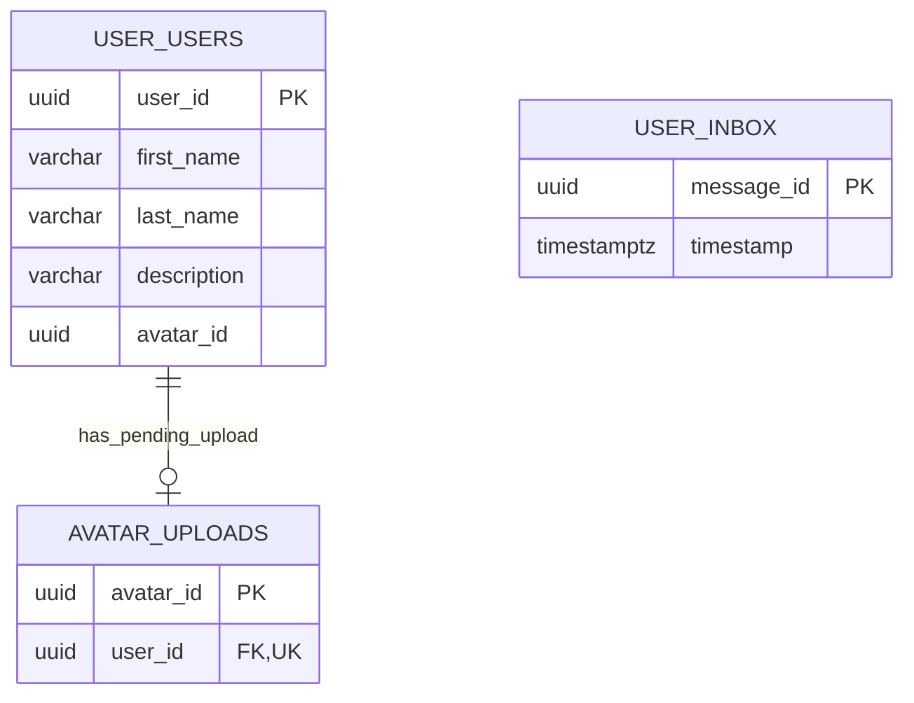

# ChefBook Backend User Service

The user service owns public user profile fields and avatar upload lifecycle. It is not responsible for credentials, sessions, or OAuth; those belong to `auth`.

## Responsibilities

- Store user display name fields.
- Store user description.
- Coordinate avatar upload links and upload confirmation.
- Delete user avatar metadata.
- Provide public/minimal user info to other services.

## Main RPC Families

- `GetUsersMinInfo`
- `GetUserInfo`
- `SetUserName`
- `SetUserDescription`
- `GenerateUserAvatarUploadLink`
- `ConfirmUserAvatarUploading`
- `DeleteUserAvatar`

## Dependencies

- Owns its PostgreSQL schema and migrations.
- Consumes profile/account lifecycle messages through MQ when configured.
- Uses the same logical `user_id` as `auth`, without cross-database foreign keys.

## Database Ownership

Owns:

- `users` - public name, description, and current avatar ID.
- `avatar_uploads` - pending avatar upload lifecycle.
- `inbox` - idempotent MQ message processing.

Important constraints:

- `avatar_uploads` is one-to-one with `users`.
- `user_id` is a logical cross-service identity shared with auth/profile flows.
